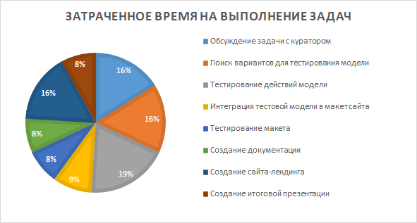

# График, индивидуальные планы работы и отчёт

## План работы над проектом

1. Обсуждение задачи с куратором.
2. Поиск вариантов для тестирования модели.
3. Тестирование действий модели.
4. Интеграция тестовой модели в макет сайта.
5. Тестирование макета.
6. Создание документации.
7. Создание сайта-лендинга.
8. Создание итоговой презентации.

## Индивидуальные планы работы

- [Гладышев Андрей](gladyshev.md)
- [Лобанова Валерия](lobanova.md)
- [Стефанова Дарья](stefanova.md)
- [Базавлюк Ольга](bazavluk.md)

## Отчёт  [Отчет в формате docx](Otchet.docx)

### Аннотация проекта
Название проекта: Аватар для жестового языка;
- Участники проекта: студенты группы 191 – 361, Гладышев Андрей, Лобанова Валерия, Стефанова Дарья, Базавлюк Ольга;
- Цели и задачи проекта:
  - Тестирование возможности использования библиотеки tree.js для нужд жестового словаря.
  - Тестирование возможности встраивания библиотеки tree.js в интерфейс словаря.
  - Создание действующего макета интерфейса.
- Описание проекта:

На данный момент существует словарь русского жестового языка, но для каждого слова необходимо собирать команду и записывать видеоролик, что не всегда представляется возможным, а так же является дорогостоящим процессом. Для решения данной проблемы предлагается создать 3d модель, с помощью которой можно будет генерировать новые жесты и воспроизводить их. При создании данной модели сократятся расходы на запись, так как не нужно будет собирать команду для записи. Также с помощью шаблонов, можно создавать новые сложные жесты и расширять словарь.
- Информационные технологии: JavaScript, Html, Css ;
- Ключевые слова: Аватар для жестового языка; 
- Сайт описание - проекта: http://pd-2020-2.std-1489.ist.mospolytech.ru/
- Сайт проекта: http://pd-2020.std-1489.ist.mospolytech.ru/
### Общее задание:
- Подбор модели, написанной на библиотеке three.js для ее тестирования; 
- Интеграция модели в макет сайта https://slovar.jest.su/about;
- Разработка вспомогательного сайта;
- Создание документации
План работы:
- Обсуждение задачи с куратором;
- Поиск вариантов для тестирования модели;
- Тестирование действий модели;
- Интеграция тестовой модели в макет сайта;
- Тестирование макета;
- Создание документации;
- Создание сайта-лендинга;
- Создание итоговой презентации.

### Участники и их роли
- Харламенков А.Е. – Куратор
- Гладышев А.А. – Программист, разработчик
- Лобанова В.В. – Программист, разработчик
- Базавлюк О.И. – Технический писатель
- Стефанова Д.К. – Веб-дизайнер

### Содержательные главы.
Для хранения данных по проекту был создан Git репозиторий на сервисе GitHub. Просмотреть его можно по данной ссылке: https://github.com/Olga2001/AI-lab. Для представления нашего проекта был разработан отдельный сайт, который находится в данный момент по данному адресу: http://pd-2020-2.std-1489.ist.mospolytech.ru/. На данном сайте можно прочитать краткую информацию о проекте, его участниках, целях и задачах.

Для работы над проектом была изучена библиотека three.js, являющаяся более подходящей для целей проекта. Для написания документации был изучен ГОСТ 19 серии.

### Актуальность
Модель размещается на сайте с целью упрощения работы по добавлению в словарь жестов «русского жестового языка», так как при появлении нового жеста необходимо проверить его наличие в словаре, далее собрать команду для съемки, нанять актера, затем отредактировать полученное видео и добавить его на сайт.

Получается, что на один жест затрачивается очень много сил, времени и денежных средств. Для решения данной проблемы и предлагается данное программное обеспечение, которое упросит добавление жестов в словарь, а значит сможет сэкономить время. Так же благодаря словарю при создании нового жеста к слову, будет проще определить есть ли такой жест в базе и понять как изменить последовательность элементов, чтобы получить уникальный жест.

### Отчет о результатах работы над проектом:
Все поставленные задачи были успешно выполнены, а именно:
- Обсуждение задачи с куратором;
- Поиск вариантов для тестирования модели;
- Тестирование действий модели;
- Интеграция тестовой модели в макет сайта;
- Тестирование макета;
- Создание документации;
- Создание сайта-лендинга;
- Создание итоговой презентации.

Время, затраченное на завершение той или иной задачи показываются в виде следующей круговой диаграммы:

Таким образом, входе работы над данным проектом были предоставлены сайт с внедренной моделью из библиотеки three.js, сайт лендинг. Полностью задокументированные и хранимые на GitHub репозитории.

### Заключение
В качестве результата реализации проекта команда выполнила следующие задачи:
- Подбор модели, написанной на библиотеке three.js для ее тестирования; 
- Интеграция модели в макет сайта https://slovar.jest.su/about;
- Разработка вспомогательного сайта;
- Создание документации.
Таким образом поставленные цели были выполнены. 

В процессе выполнения поставленных задач участники команды научились работать в команде, приобрели навыки разработки дизайна для сайта, верстки сайта, а также навыки написания технической документации.

